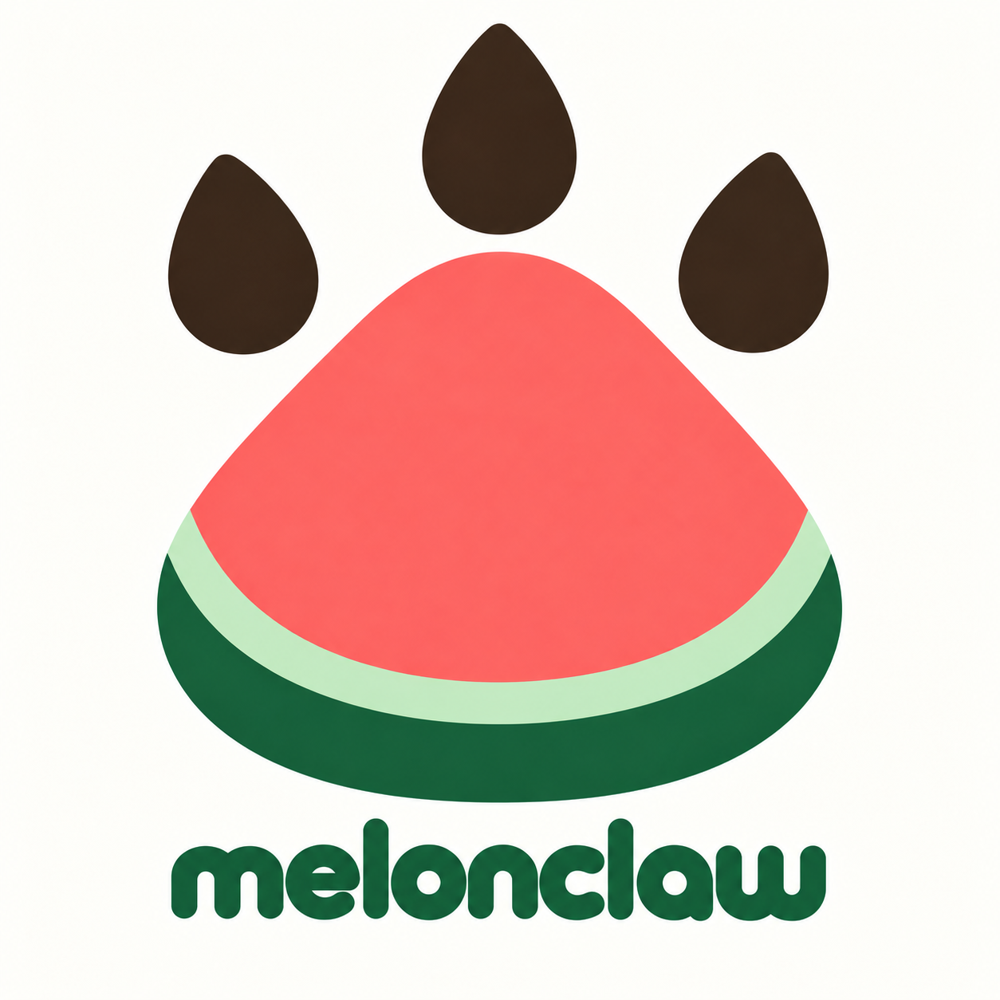

# MelonClaw

<p align="center">
  
</p>

MelonClaw 是一个基于 Deep Agents 的通用 AI 助手。通过 Web 界面处理问答、写作、研究和计划制定等任务，并可按需使用联网搜索、文件工作区、MCP 工具、子 Agent 和 JavaScript 计算能力。

## ✨ 项目特色

- 🧠 **通用任务处理** — 问答、总结、翻译、分析、研究和计划制定
- 🔍 **联网搜索** — 配置 Tavily 后即可获取实时资料并核验来源
- 📁 **多会话工作区** — Project 下的会话共享持久文件目录，对话状态彼此隔离
- 🤝 **子 Agent 协作** — 独立工作委派给子 Agent，主 Agent 汇总结果
- 🧮 **安全计算** — QuickJS Interpreter 完成纯计算，无文件、网络和 Shell 权限
- ✅ **可控副作用** — 写文件、删文件和执行 Shell 前需人工批准、编辑参数或拒绝
- 💾 **长期记忆与恢复** — PostgreSQL 保存业务数据、对话 Checkpoint 和多级 Memory
- 🎛️ **系统模型选择** — 发送按钮旁可选择当前轮使用的系统模型；模型目录由代码维护，运行参数由 `.env` 提供
- ⚡ **流式反馈** — 实时展示回答、工具调用、子 Agent 状态和审批过程

聊天正文会隐藏模型返回的 `<think>…</think>` 推理块和独立的内部工具选择 JSON；推理期间可能暂时没有正文输出。过滤仅作用于展示内容，模型继续执行所需的原始消息保留在运行状态中。

运行提示会根据事件显示「正在准备」「正在工具筛选」「思考中」「正在回复」；工具执行时显示「处理中」。其中「思考中」表示主模型正在生成、尚未输出正文，不展示推理内容；没有识别到工具选择器阶段时不会默认显示工具筛选。

助手消息可展开「思路摘要」面板，查看准备执行、思考、工具调用、子任务和回复生成等可验证阶段。面板默认在执行中展开、完成后收起；它不会显示模型的原始隐藏推理文本。

助手输出期间仍可点击「新建对话」（或 ⌘/Ctrl + K），并在新会话发送消息。原会话的输出连接继续保留，返回原会话可查看结果或处理审批。模型下拉框也可随时调整，选择从下一条消息生效，正在执行的回复和审批恢复仍使用原运行的模型。同一会话执行中仍不能重复发送；若返回时提示请求尚未结束，请稍后点击「重新同步会话」。

## 📋 环境要求

- Python 3.11+、`uv`、PostgreSQL 14+
- 一个模型 API（默认 DeepSeek，支持 OpenAI 兼容接口）
- Tavily API Key（可选，联网搜索用）
- Node.js 20+ 与 npm（可选，独立开发前端时用）

## 🚀 快速开始

### 1️⃣ 获取代码并配置

```bash
git clone <your-repository-url>
cd melonclaw
cp .env.example .env
```

在 `.env` 中填写模型和数据库配置（数据库需提前创建）：

```dotenv
DEEPAGENTS_PROVIDER=DEEPSEEK_MODEL_FLASH
DEEPSEEK_BASE_URL=https://api.deepseek.com
DEEPSEEK_API_KEY=你的 DeepSeek API Key
DEEPSEEK_MODEL_FLASH=你的 DeepSeek Flash 模型名
DEEPSEEK_MODEL_PRO=你的 DeepSeek Pro 模型名

MINIMAX_BASE_URL=https://api.minimax.cn/v1
MINIMAX_API_KEY=你的 MiniMax API Key
MINIMAX_MODEL_M3=你的 MiniMax M3 模型名
MINIMAX_MODEL_M27=你的 MiniMax M2.7 模型名

DATABASE_URL=postgresql+asyncpg://用户名:密码@127.0.0.1:5432/melonclaw
TAVILY_API_KEY=你的 Tavily API Key
```

### 2️⃣ 安装依赖并初始化数据库

```bash
uv sync --locked
uv run melonclaw-db-init
```

### 3️⃣ 启动 / 重启 / 停止

```bash
scripts/start.sh      # 一键启动（前端 Vite + 后端 FastAPI）
scripts/restart.sh    # 按当前状态自动启动或停止后重启
scripts/shutdown.sh   # 一键停止
```

打开 <http://127.0.0.1:8001> 即可使用。端口被占用时脚本不会启动任何服务，请先执行 `scripts/shutdown.sh`。

> 💡 后端需在 IDE 中手工调试时，可加 `frontend` 参数只操作前端：`scripts/start.sh frontend`。监听地址和端口可通过 `MELONCLAW_HOST`、`MELONCLAW_PORT`、`MELONCLAW_FRONTEND_HOST`、`MELONCLAW_FRONTEND_PORT` 修改。

## 💬 如何使用

1. 选择开发用模拟用户，创建或选择一个 Project，新建会话后直接描述任务。
2. 在发送按钮左侧的模型下拉框选择本轮要使用的模型；当前提供 DeepSeek Flash、DeepSeek Pro、MiniMax M3 和 MiniMax M2.7，选项只显示模型名（实际可用项取决于 `.env` 配置）。
3. Agent 会自动决定是否搜索资料、读写项目文件、调用 MCP、委派子 Agent 或使用 Interpreter。
4. 涉及写文件或执行 Shell 时，审批卡片会展示工具和参数，逐项选择「允许本次」「编辑参数」或「拒绝」后提交。

常用玩法：

- 🔎 **联网研究** — 直接提出需要实时资料或来源核验的问题
- 📝 **文件处理** — 在 Agent 中使用类似 `/summary.md` 的工作区路径，文件写入 Project 持久工作区（默认 `~/.melonclaw/workspaces`）
- 📊 **数据计算** — 让 Agent 用 `eval` 完成循环、排序、聚合等纯计算

## ⚙️ 可选配置

| 变量 | 用途 |
| --- | --- |
| `DEEPAGENTS_PROVIDER` | 启动时的默认模型键；使用 `DEEPSEEK_MODEL_FLASH`、`DEEPSEEK_MODEL_PRO`、`MINIMAX_MODEL_M3` 或 `MINIMAX_MODEL_M27` |
| `DEEPSEEK_BASE_URL` / `DEEPSEEK_API_KEY` | DeepSeek 兼容接口地址和凭据 |
| `DEEPSEEK_MODEL_FLASH` / `DEEPSEEK_MODEL_PRO` | DeepSeek 的 Flash / Pro 模型名 |
| `MINIMAX_BASE_URL` / `MINIMAX_API_KEY` | MiniMax 兼容接口地址和凭据 |
| `MINIMAX_MODEL_M3` / `MINIMAX_MODEL_M27` | MiniMax M3 / M2.7 模型名 |
| `OPENAI_*` | OpenAI 兼容接口的单模型配置 |
| `TAVILY_API_KEY` | 启用联网搜索 |
| `DATABASE_URL` | PostgreSQL 连接串 |
| `TUSHARE_MCP_TOKEN` | Tushare 取数 Skill（`tushare-fetcher`）的访问 Token |
| `MELONCLAW_SHELL_ENV_ALLOWLIST` | 额外放行给 Agent Shell 环境的变量白名单，逗号分隔，支持 `NAME` 精确与 `PREFIX_*` 前缀匹配 |
| `MELONCLAW_WORKSPACE_DIR` | Project 工作区根目录 |
| `MELONCLAW_HOST` / `MELONCLAW_PORT` | 后端监听地址和端口 |
| `MELONCLAW_FRONTEND_HOST` / `MELONCLAW_FRONTEND_PORT` | 前端开发服务器监听地址和端口 |
| `MELONCLAW_ALLOWED_ORIGINS` | 独立前端跨域部署时放行的 origin |

MCP 服务定义放在根目录 `mcp.json`（可为 `{}` 留空）；`.env` 中的 Token 用于替换其中 `${VARIABLE_NAME}` 占位符。

模型选择说明：模型目录定义在 `src/melonclaw/core/model_catalog.py`，稳定的模型 ID 和
展示名由代码分配；供应商连接信息及各模型的实际名称从 `.env` 读取。`GET /api/models`
返回当前用户和租户上下文可用的 DeepSeek/MiniMax 模型，发送接口通过 `model_id` 指定
本轮模型，下拉框只显示实际模型名。`DEEPAGENTS_PROVIDER` 仍然用于指定启动时的默认
模型，例如 `DEEPAGENTS_PROVIDER=DEEPSEEK_MODEL_PRO`。模型选择会随本地用户/租户上下文
保存，但每次请求仍由后端重新校验，消息历史保存实际使用的非敏感模型快照。当前阶段
不提供用户模型配置入口。

### Skill 脚本的凭据注入（三层配置）

melonclaw 的配置分三层：**代码默认层**（`src/melonclaw/core/defaults.py`，所有用户共享的凭据变量名、默认模型）→ **部署者层**（`.env`，凭据的值）→ **用户层**（未来多租户的数据库配置，规划中）。

- Agent Shell 子进程默认注入 `HOME`、`LANG`、`LC_*`、`TZ` 等基础变量，加上 `core/defaults.py` 中 `DEFAULT_AGENT_ENV_VARS` 集合声明的凭据变量（当前含 `TUSHARE_MCP_TOKEN`、`TUSHARE_TOKEN`、`APP_ID`、`APP_SECRET`、`YUJIAN_MCP_TOKEN`），值取自 `.env`；
- 新增仓库内 Skill 依赖新凭据：提交代码时把变量名加进该集合，部署者在 `.env` 填值，重启生效——代码里永远只有名字，没有值；
- 临时放行未收录的变量：`.env` 配 `MELONCLAW_SHELL_ENV_ALLOWLIST=NAME,PREFIX_*`；
- `DEEPSEEK_API_KEY`、`DATABASE_URL`、`TAVILY_API_KEY` 等应用自身凭据受硬黑名单保护，任何配置层都不能注入给 Agent 执行的命令。

## 🖥️ 前端独立开发与部署

前端位于 `frontend/`，是独立的 React + Vite + TypeScript 项目：

```bash
cd frontend
npm install
npm run dev -- --host 127.0.0.1   # 开发模式，Vite 会把 /api 代理到后端
npm run build                     # 构建产物输出到 frontend/dist/
```

生产部署时由 Nginx 或 Node 静态服务托管 `dist/`，并将 `/api` 反向代理到 FastAPI（SSE 需关闭缓冲）；跨域直连时用 `VITE_API_BASE_URL` 指定后端地址。

## ⚠️ 使用边界

- `.env` 中的 API Key、Token 和数据库密码只保存在本地，不要提交到 Git。
- 页面中的用户和租户是开发入口，不代表生产环境的身份认证。
- `LocalShellBackend` 不是安全沙箱，不要在不受信任的环境中直接开放服务。
- 联网搜索、MCP 和模型调用依赖相应外部服务；未配置时其他能力仍可使用。
