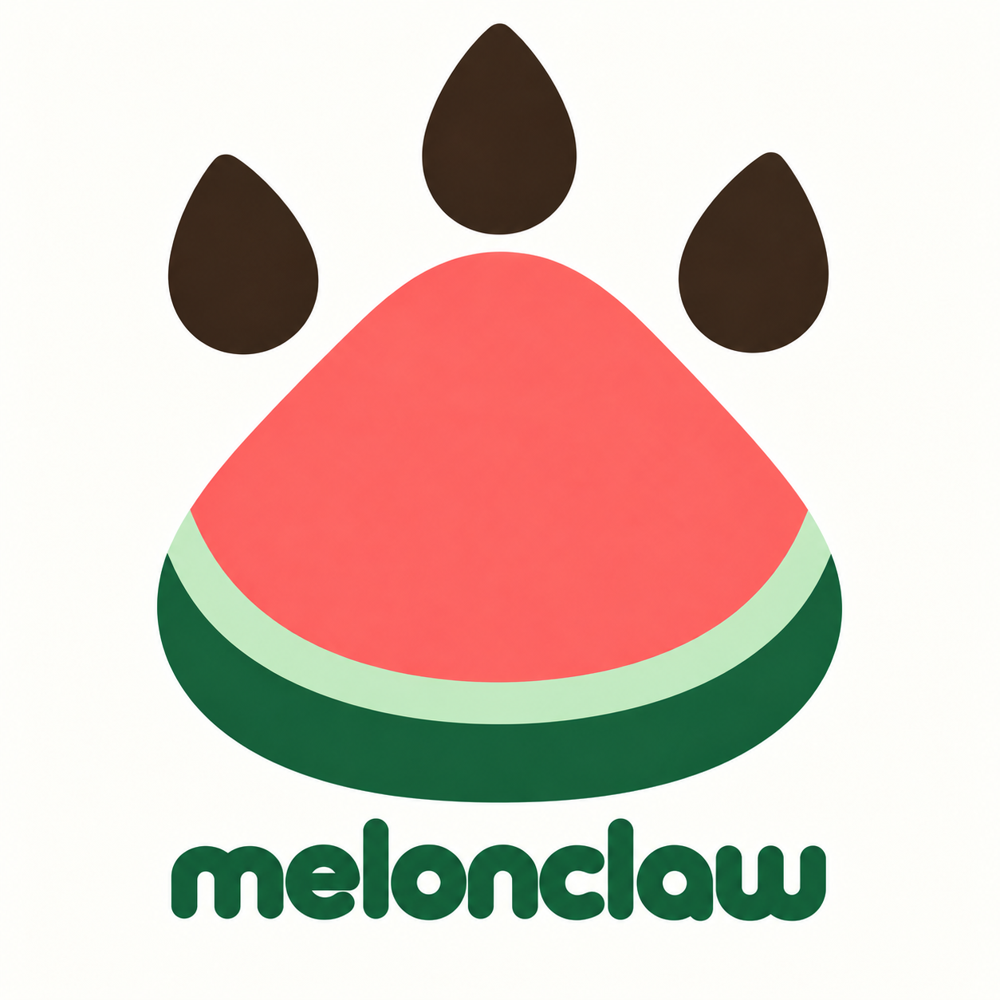

# MelonClaw

<p align="center">
  
</p>

MelonClaw 是一个基于 Deep Agents 的通用 AI 助手。通过 Web 界面处理问答、写作、研究和计划制定等任务，并可按需使用联网搜索、文件工作区、MCP 工具、子 Agent 和 JavaScript 计算能力。

## ✨ 项目特色

- 🧠 **通用任务处理** — 问答、总结、翻译、分析、研究和计划制定
- 🔍 **联网搜索** — 配置 Tavily 后即可获取实时资料并核验来源
- 📁 **多会话工作区** — 普通会话各自拥有持久工作区，Project 内的会话共享项目工作区；消息状态始终按会话隔离
- 🤝 **子 Agent 协作** — 独立工作委派给子 Agent，主 Agent 汇总结果
- 🧮 **安全计算** — QuickJS Interpreter 完成纯计算，无文件、网络和 Shell 权限
- ✅ **可控副作用** — 写文件、删文件和执行 Shell 前需人工批准、编辑参数或拒绝
- 🙋 **主动询问用户** — 关键偏好缺失或存在多个合理方案时，Agent 暂停并展示结构化选项，用户选择后继续执行
- 💾 **长期记忆与恢复** — PostgreSQL 保存业务数据、对话 Checkpoint 和多级 Memory
- 🎛️ **系统模型选择** — 发送按钮旁可选择当前轮使用的系统模型；模型目录由代码维护，运行参数由 `.env` 提供
- 📎 **加号二级目录与附件** — 左下角加号展开「图片和文件 / 技能」两级目录，技能列表与输入 `/` 一致；附件弹窗支持拖拽、多选、逐项移除后统一确认添加，带上传进度与解析重试
- 🧩 **Skill 快速选择** — 在聊天框输入 `/` 浏览已安装技能，支持关键词过滤和键盘选择
- ⚡ **流式反馈** — 实时展示回答、工具调用、子 Agent 状态和审批过程
- ⏹️ **停止生成** — AI 输出时发送按钮变为方形停止键，点击即显式取消本轮（消息显示“本次回复已中止”）；回车不会误触停止。切换会话不会中断输出，正在跑的会话在左栏显示旋转图标，切回可继续看输出；多会话可同时跑，停止只影响当前会话
- 🧭 **执行过程展示** — 一次运行聚合成一个可折叠的执行区域：过程文本与工具调用按因果顺序滚动更新，与正式回答左对齐，状态行下方带浅灰分隔线，运行结束后默认收起，最终回答始终独立展示
- 🧰 **系统工具目录** — 聊天顶栏可打开工具目录，按文件、命令、搜索、记忆、协作和 MCP 分类查看固定工具及语义图标；MCP 工具名称以运行时发现结果为准

聊天正文会隐藏模型返回的 `<think>…</think>` 推理块和独立的内部工具选择 JSON；推理期间可能暂时没有正文输出。过滤仅作用于展示内容，模型继续执行所需的原始消息保留在运行状态中。

运行提示会根据事件显示「正在准备」「正在工具筛选」「思考中」「正在回复」；工具执行时显示「处理中」。其中「思考中」表示主模型正在生成、尚未输出正文，不展示推理内容；没有识别到工具选择器阶段时不会默认显示工具筛选。

助手流式输出时会按真实顺序直接展示中间 AIMessage、工具调用/结果和后续 AIMessage；运行期间执行过程保持展开，完成后默认收起，点击状态摘要即可重新查看完整过程。后端标记为最终回答的那条 AIMessage 始终作为正文单独渲染。执行过程头部只显示执行状态与耗时，不在摘要行重复显示工具名称；工具与子 Agent 使用统一的执行节点样式，所有内容保持左对齐，参数、结果及子 Agent 输出按需展开，完成状态统一显示为“完成”。AI 文本与执行节点分开渲染，不展示模型的原始隐藏推理文本；本轮没有实际工具调用时不会伪造工具记录，助手消息元信息也不重复显示“已完成”等状态。

助手输出期间仍可点击「新建对话」（或 ⌘/Ctrl + K），并在新会话发送消息。原会话的输出连接继续保留，返回原会话可查看结果或处理审批。模型下拉框也可随时调整，选择从下一条消息生效，正在执行的回复和审批恢复仍使用原运行的模型。同一会话执行中仍不能重复发送；若返回时提示请求尚未结束，请稍后点击「重新同步会话」。

## 📋 环境要求

- Python 3.11+、`uv`、PostgreSQL 14+
- 一个模型 API（默认 DeepSeek，支持 OpenAI 兼容接口）
- Tavily API Key（可选，联网搜索用）
- Node.js 20+ 与 npm（可选，独立开发前端时用）

## 🚀 快速开始

### 1️⃣ 获取代码并配置

```bash
git clone <your-repository-url>
cd melonclaw
cp .env.example .env
```

在 `.env` 中填写模型和数据库配置（数据库需提前创建）：

```dotenv
DEEPAGENTS_PROVIDER=DEEPSEEK_MODEL_FLASH
DEEPSEEK_BASE_URL=https://api.deepseek.com
DEEPSEEK_API_KEY=你的 DeepSeek API Key
DEEPSEEK_MODEL_FLASH=你的 DeepSeek Flash 模型名
DEEPSEEK_MODEL_PRO=你的 DeepSeek Pro 模型名

MINIMAX_BASE_URL=https://api.minimax.cn/v1
MINIMAX_API_KEY=你的 MiniMax API Key
MINIMAX_MODEL_M3=你的 MiniMax M3 模型名
MINIMAX_MODEL_M27=你的 MiniMax M2.7 模型名

DATABASE_URL=postgresql+asyncpg://用户名:密码@127.0.0.1:5432/melonclaw
TAVILY_API_KEY=你的 Tavily API Key
```

### 2️⃣ 安装依赖并初始化数据库

```bash
uv sync --locked
uv run melonclaw-db-init
```

数据库按“可清空重建”维护，不为历史数据做兼容迁移。表结构只定义在
`src/melonclaw/database/schema.py`，改动表结构后重建/清空数据库并重新执行
`uv run melonclaw-db-init` 即可。初始化命令和服务启动会校验业务表及列是否
与当前 schema 一致；不一致时提示清空重建，不会自动迁移或补列。

### 3️⃣ 启动 / 重启 / 停止

```bash
scripts/start.sh      # 一键启动（前端 Vite + 后端 FastAPI）
scripts/restart.sh    # 按当前状态自动启动或停止后重启
scripts/shutdown.sh   # 一键停止
```

打开 <http://127.0.0.1:8001> 即可使用。端口被占用时脚本不会启动任何服务，请先执行 `scripts/shutdown.sh`。

> 💡 后端需在 IDE 中手工调试时，可加 `frontend` 参数只操作前端：`scripts/start.sh frontend`。监听地址和端口可通过 `MELONCLAW_HOST`、`MELONCLAW_PORT`、`MELONCLAW_FRONTEND_HOST`、`MELONCLAW_FRONTEND_PORT` 修改。

## 💬 如何使用

1. 选择开发用模拟用户。点击「新建对话」会把右侧切到普通会话空白页，发送第一条消息时左侧立即出现新会话；当前已经是空白页时再点不会重复创建。点击侧栏项目文件夹只会展开或收起会话列表，不会切换右侧聊天；点击列表中的具体会话才会打开它。项目行右侧“…”后面的新建会话图标会切到该项目的空白页，项目还没有会话时，展开区也会显示「在此项目中新建首个对话」。项目会话的顶栏显示「项目名称/会话名称」，普通会话只显示会话名称。输入框上方灰色栏可搜索、选择或新建项目，也可选择「不在项目中工作」。项目和对话行悬停时会出现“…”菜单，可置顶、重命名或删除；触屏时菜单按钮常显。普通会话的“…”菜单还可选择「移动到项目」，再选「新建项目」或已有项目；移动后会话文件和附件进入目标项目，项目内会话不提供移动入口。会话仍在运行、有未完成交互或有尚未提交的附件时，需先处理后再移动；目标项目中有同名文件时会拒绝覆盖。删除会让资源及其历史从界面不可访问，但开发期仍保留数据库记录和工作区文件，不执行物理清理。
2. 在发送按钮左侧的模型下拉框选择本轮要使用的模型；当前提供 DeepSeek Flash、DeepSeek Pro、MiniMax M3 和 MiniMax M2.7，选项只显示模型名（实际可用项取决于 `.env` 配置）。
3. 在聊天输入框输入 `/` 打开 Skill 目录；继续输入关键词可以过滤，使用方向键和 Enter 选择。选中的 Skill 会以标签显示，并从本轮消息中生效。
4. 点击输入框左下角的「+」展开二级目录：「图片和文件」打开「添加附件」弹窗（可拖拽文件到上传区，也可点击从文件夹多选；弹窗里写明支持的类型与大小、数量限制，上传后可逐项移除，点「确认添加附件」统一加入输入区，点「取消」则放弃本次上传）；「技能」悬停后在右侧列出与输入 `/` 相同的技能列表，选中即应用到本轮消息。把文件拖到输入区或粘贴剪贴板图片会跳过目录直接打开附件弹窗。等待文档解析完成后即可发送，解析失败或超时可点「重新解析」；图片在输入区和历史消息里都能点开预览，历史消息会展示附件状态与下载入口。
5. Agent 会自动决定是否搜索资料、读写项目文件、调用 MCP、委派子 Agent 或使用 Interpreter。点击聊天顶栏的「系统工具」可以查看固定工具的分类、友好名称、原始工具名和图标；MCP 服务会列出当前配置的服务名，具体工具在连接后由运行时发现。
6. 涉及写文件/删除文件时，审批卡片会展示工具和参数，逐项选择「允许本次」「编辑参数」或「拒绝」后提交。Shell `execute` 处在过渡期免审批（沙箱落地后恢复，见技术债 D10），仅限本机 `127.0.0.1` 单用户开发使用。审批提交会绑定当前 `approval_batch_id` 和 `assistant_message_id`；如果页面过期或审批状态已变化，请重新同步会话后再提交。
7. 当任务缺少会显著改变结果的关键信息，或有多个无法自动取舍的方案时，Agent 会主动暂停并展示一张「等待你的回答」问题卡；卡片可以包含多个独立问题，全部回答后一次点击「提交全部回答并继续」。每个问题支持单选、多选或填写自定义回答。不想回答时点「跳过，让 AI 自己决定」，Agent 会自己收尾后继续。问题默认 24 小时后过期：过期卡片不能再提交，直接发送新消息会自动跳过它并解锁会话。

常用玩法：

- 🔎 **联网研究** — 直接提出需要实时资料或来源核验的问题
- 📝 **文件处理** — 在 Agent 中使用类似 `/summary.md` 的工作区路径；普通会话写入该会话目录，Project 会话写入项目持久工作区（默认 `~/.melonclaw/workspaces`）
- 📊 **数据计算** — 让 Agent 用 `eval` 完成循环、排序、聚合等纯计算

## ⚙️ 可选配置

| 变量 | 用途 |
| --- | --- |
| `DEEPAGENTS_PROVIDER` | 启动时的默认模型键；使用 `DEEPSEEK_MODEL_FLASH`、`DEEPSEEK_MODEL_PRO`、`MINIMAX_MODEL_M3` 或 `MINIMAX_MODEL_M27` |
| `DEEPSEEK_BASE_URL` / `DEEPSEEK_API_KEY` | DeepSeek 兼容接口地址和凭据 |
| `DEEPSEEK_MODEL_FLASH` / `DEEPSEEK_MODEL_PRO` | DeepSeek 的 Flash / Pro 模型名 |
| `MINIMAX_BASE_URL` / `MINIMAX_API_KEY` | MiniMax 兼容接口地址和凭据 |
| `MINIMAX_MODEL_M3` / `MINIMAX_MODEL_M27` | MiniMax M3 / M2.7 模型名 |
| `OPENAI_*` | OpenAI 兼容接口的单模型配置 |
| `TAVILY_API_KEY` | 启用联网搜索 |
| `DATABASE_URL` | PostgreSQL 连接串 |
| `TUSHARE_MCP_TOKEN` | Tushare 取数 Skill（`tushare-fetcher`）的访问 Token |
| `MELONCLAW_SHELL_ENV_ALLOWLIST` | 额外放行给 Agent Shell 环境的变量白名单，逗号分隔，支持 `NAME` 精确与 `PREFIX_*` 前缀匹配 |
| `MELONCLAW_WORKSPACE_DIR` | 工作区根目录；其下按 `projects/<project_id>` 和 `conversations/<conversation_id>` 分隔 |
| `MELONCLAW_AGENT_CACHE_ENTRIES` | Agent 工作区缓存上限（默认 32），只影响可重建的内存实例 |
| `MELONCLAW_HOST` / `MELONCLAW_PORT` | 后端监听地址和端口 |
| `MELONCLAW_FRONTEND_HOST` / `MELONCLAW_FRONTEND_PORT` | 前端开发服务器监听地址和端口 |
| `MELONCLAW_ALLOWED_ORIGINS` | 独立前端跨域部署时放行的 origin |
| `MELONCLAW_ATTACHMENT_MAX_FILE_MB` / `MELONCLAW_ATTACHMENT_MAX_PER_MESSAGE` | 单个附件大小（默认 20 MB）和单条消息附件数量（默认 10） |
| `MELONCLAW_ATTACHMENT_MAX_TOTAL_MB` / `MELONCLAW_ATTACHMENT_PROJECT_MAX_MB` | 单条消息总大小（默认 50 MB）和每个工作区附件原文+派生文件总配额（默认 1024 MB）；后一个变量沿用现有名称 |
| `MELONCLAW_ATTACHMENT_IMAGE_MAX_PIXELS` / `MELONCLAW_ATTACHMENT_PDF_MAX_PAGES` | 图片像素上限（默认 30000000）和 PDF 页数上限（默认 500） |
| `MELONCLAW_ATTACHMENT_PARSE_MAX_CHARS` | 单附件派生文本字符上限（默认 2000000） |
| `MELONCLAW_ATTACHMENT_ARCHIVE_MAX_ENTRIES` / `MELONCLAW_ATTACHMENT_ARCHIVE_MAX_UNCOMPRESSED_MB` / `MELONCLAW_ATTACHMENT_ARCHIVE_MAX_ENTRY_MB` | OOXML 容器条目数、总解压大小和单条目大小限制 |
| `MELONCLAW_ATTACHMENT_ARCHIVE_MAX_COMPRESSION_RATIO` | OOXML 总解压/压缩大小最大比值（默认 50） |
| `MELONCLAW_ATTACHMENT_STAGED_TTL_HOURS` / `MELONCLAW_ATTACHMENT_PARSE_CONCURRENCY` | 未发送附件保留时长（默认 24 小时）和后台解析并发数（默认 2） |
| `MELONCLAW_ATTACHMENT_VALIDATE_TIMEOUT_SECONDS` / `MELONCLAW_ATTACHMENT_PARSE_TIMEOUT_SECONDS` | 校验和解析超时配置；解析超时会将附件标记为失败 |
| `MELONCLAW_ATTACHMENT_PARSE_LEASE_SECONDS` / `MELONCLAW_ATTACHMENT_PARSE_MAX_ATTEMPTS` | 解析租约和失效重试次数 |
| `MELONCLAW_ATTACHMENT_IMAGE_MAX_EDGE` / `MELONCLAW_ATTACHMENT_IMAGE_JPEG_QUALITY` | 图片出站最长边（默认 1568）和 JPEG 重编码质量（默认 85）；超限图片等比缩放后再发给模型 |
| `MELONCLAW_ATTACHMENT_IMAGE_CACHE_ENTRIES` | 图片出站编码的内存缓存条数（默认 32） |
| `MELONCLAW_USER_INPUT_TTL_SECONDS` | Agent 主动提问的等待有效期（默认 86400 秒）；过期后需重新发起任务 |
| `MELONCLAW_IDENTITY_HEADER` | 可选：受信任网关注入 user_id 的请求头名；留空时仍使用页面提交的 user_id（开发模拟用户） |

Agent 主动提问只在浏览器随消息声明 `user_input_v1` 能力时启用（Web 端已默认声明）：未声明能力的客户端拿不到提问工具，助手会改用普通文字追问，不会发出渲染不出来的问题卡片。含提问的工具批次如果还夹着其他工具，整批都会被拒绝，避免副作用在用户回答前发生。

回答提交后如果进程崩溃，这一轮不会也不允许自动重放（不知道副作用执行到了哪一步）：历史里它会显示为失败，而不是一张永远在等你、点了还报错的卡片；直接发新消息即可结束这一轮——服务层会先用一次“取消”唤醒 Checkpoint 让它收尾，再执行你的新消息。答案本身填错（选了不存在的选项、这里不允许自定义文本）返回 422 `user_answer_invalid`；这类错误和“这一轮已经变了”的 409 是分开的。

MCP 服务定义放在根目录 `mcp.json`（可为 `{}` 留空）；`.env` 中的 Token 用于替换其中 `${VARIABLE_NAME}` 占位符。多个 MCP 服务会并行发现工具，单个服务连接失败或返回 401 时会被跳过，其他服务和内置能力仍可用；运行时只读工具 `list_mcp_tools` 会报告每个服务的 `status`、可用工具和脱敏错误摘要。

模型选择说明：模型目录定义在 `src/melonclaw/core/model_catalog.py`，稳定的模型 ID 和
展示名由代码分配；供应商连接信息及各模型的实际名称从 `.env` 读取。`GET /api/models`
返回当前用户和租户上下文可用的 DeepSeek/MiniMax 模型，发送接口通过 `model_id` 指定
本轮模型，下拉框只显示实际模型名。`DEEPAGENTS_PROVIDER` 仍然用于指定启动时的默认
模型，例如 `DEEPAGENTS_PROVIDER=DEEPSEEK_MODEL_PRO`。模型选择会随本地用户/租户上下文
保存，但每次请求仍由后端重新校验，消息历史保存实际使用的非敏感模型快照。当前阶段
不提供用户模型配置入口。

### Skill 脚本的凭据注入（三层配置）

melonclaw 的配置分三层：**代码默认层**（`src/melonclaw/core/defaults.py`，所有用户共享的凭据变量名、默认模型）→ **部署者层**（`.env`，凭据的值）→ **用户层**（未来多租户的数据库配置，规划中）。

- Agent Shell 子进程默认注入 `HOME`、`LANG`、`LC_*`、`TZ` 等基础变量，加上 `core/defaults.py` 中 `DEFAULT_AGENT_ENV_VARS` 集合声明的凭据变量（当前含 `TUSHARE_MCP_TOKEN`、`TUSHARE_TOKEN`、`APP_ID`、`APP_SECRET`、`YUJIAN_MCP_TOKEN`），值取自 `.env`；
- 新增仓库内 Skill 依赖新凭据：提交代码时把变量名加进该集合，部署者在 `.env` 填值，重启生效——代码里永远只有名字，没有值；
- 临时放行未收录的变量：`.env` 配 `MELONCLAW_SHELL_ENV_ALLOWLIST=NAME,PREFIX_*`；
- `DEEPSEEK_API_KEY`、`DATABASE_URL`、`TAVILY_API_KEY` 等应用自身凭据受硬黑名单保护，任何配置层都不能注入给 Agent 执行的命令。

## 🖥️ 前端独立开发与部署

前端位于 `frontend/`，是独立的 React + Vite + TypeScript 项目：

```bash
cd frontend
npm install
npm run dev -- --host 127.0.0.1   # 开发模式，Vite 会把 /api 代理到后端
npm run build                     # 构建产物输出到 frontend/dist/
```

输入与展示的行为约定（快捷键、Skill 目录与过滤、执行中的发送锁定、模型选择生效时机、Markdown 与图表渲染、Agent 执行过程的步骤/工具顺序与折叠规则、执行中的失败与审批标注）集中维护在 [docs/FRONTEND.md](docs/FRONTEND.md)。

生产部署时由 Nginx 或 Node 静态服务托管 `dist/`，并将 `/api` 反向代理到 FastAPI（SSE 需关闭缓冲）；跨域直连时用 `VITE_API_BASE_URL` 指定后端地址。

界面结构与视觉约定（侧栏分页、字号与配色、消息区版式等实现细节）集中维护在 [docs/FRONTEND.md](docs/FRONTEND.md)；本文件只保留使用者需要知道的信息。

侧栏管理接口：`PATCH /api/projects/{project_id}` 与 `PATCH /api/conversations/{conversation_id}` 接收 `user_id`、可选 `tenant_id`，以及 `name` 或 `is_pinned`；对应的 `DELETE` 接口在查询参数中接收 `user_id` 和可选 `tenant_id`。删除是开发期的逻辑删除，工作区文件暂不物理清理。新增状态字段后，旧开发数据库需清空并运行 `uv run melonclaw-db-init` 重建表。

普通会话加入项目使用 `POST /api/conversations/{conversation_id}/move-to-project`，JSON 请求体为
`user_id`、可选 `tenant_id` 和必填 `project_id`；项目内会话会被拒绝。此功能沿用现有表结构，
无需重新建表。

附件 API 由后端提供：Project 使用 `POST /api/projects/{project_id}/attachments`，普通会话使用
`POST /api/conversations/{conversation_id}/attachments` 上传，
`GET /api/attachments/capabilities` 获取支持类型与限制，`GET /api/attachments/{attachment_id}`
查询状态，`POST /api/attachments/{attachment_id}/parse` 重新解析失败的附件，
`GET /api/attachments/{attachment_id}/content` 下载原文件（响应带 `nosniff` 与
`Content-Security-Policy`），`DELETE /api/attachments/{attachment_id}` 删除尚未绑定消息的
staged 附件。发送消息时在 `POST /api/conversations/{conversation_id}/messages` 的 JSON 中提交
`attachment_ids`；正文和附件可以二选一。首版不接受 `.ppt`、普通 ZIP 或扫描型/无文本层 PDF，
也不会对图片调用 OCR；不支持图片输入的模型会在发送前拒绝图片附件。超过最长边的图片在
发往模型前会等比缩放，历史消息里已不可用的附件只降级为提示，不会让整轮执行失败。

## ⚠️ 使用边界

- `.env` 中的 API Key、Token 和数据库密码只保存在本地，不要提交到 Git。
- 页面中的用户和租户是开发入口，不代表生产环境的身份认证。
- `LocalShellBackend` 不是安全沙箱，不要在不受信任的环境中直接开放服务。
- 附件原文存放在当前工作区的 `.attachments/` 受控目录，普通会话和 Project 不会互相读取；Agent 只能读取解析后的派生文本，不能通过工具读取原图或写入附件目录；当前解析使用本机进程，不是生产级隔离沙箱。
- 联网搜索、MCP 和模型调用依赖相应外部服务；未配置时其他能力仍可使用。
