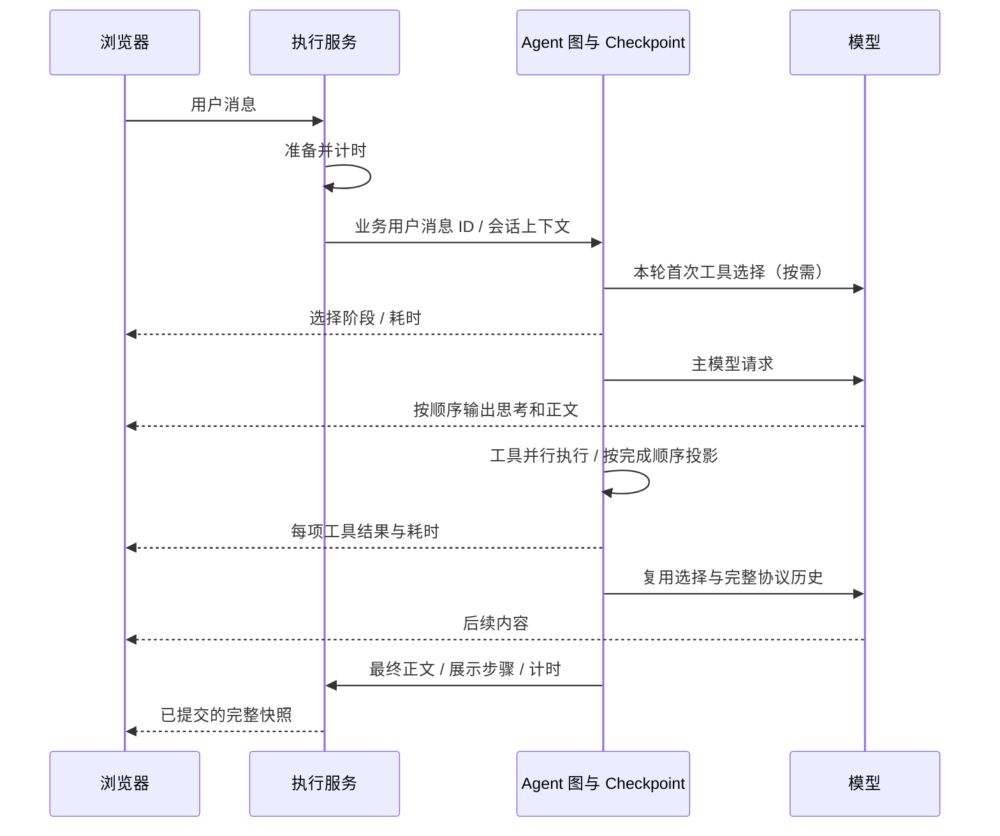

# 回复流畅性与推理协议

状态：已实现

## 背景与目标

正文转发完整仍可能长时间没有新文字：旧工具选择器在每次模型请求前重复调用相同模型，第三方思考字段可能在适配时丢失，逐项消费工具结果还会让快工具等待慢工具。本次分别处理这些原因，并保留模型、工具与准备阶段的真实等待信息。

## 方案与关键选择

### 工具选择与扩展

目录超过 16 项时，每个逻辑用户轮次只初选一次。轮次优先取业务 `user_message_id`，恢复时继续使用原 Checkpoint 的用户消息；审批和补充回答不另起轮次。选择状态写入图状态，不放在共享 Agent 实例。摘要包含当前允许工具的名称、描述和输入 schema，目录改变会失效。空选择是有效缓存结果。

选择仍使用当前模型，`TAG_NOSTREAM` 阻止内部 JSON 进入回复。超时预算由 `MELONCLAW_TOOL_SELECTION_TIMEOUT_SECONDS` 配置，默认 10 秒；错误、无效响应或超时降级为必要工具与检索入口，本轮不反复选择。主动取消和主模型失败正常传播。模型支持推理开关的差异较大，本次不自动关闭选择器推理。

`find_tools(query)` 检索组装时的已授权目录，无网络请求、数据库写入或权限修改。输入 1–512 字符，一次最多返回 8 项（描述最多 500 字符），每轮最多 4 次、额外 16 项工具；图状态 reducer 对并行 Command 共同限制预算。并行发现超过预算时以下一次实际可见 schema 为准。匹配采用名称和描述关键词，无匹配会明确返回空结果。工具无外部副作用，无需 HITL，不加入 PTC。原工具的白名单、校验、HITL 与副作用边界不变。

### 推理协议与有序内容

管理员在供应商编辑弹窗显式选择格式，保存到既有 `extra_config._melonclaw.reasoning_format`；这是本地配置，不发给供应商，不增加数据库字段。设置适用于该供应商下的模型。其余 `extra_config` 仍作为供应商请求体（例如按需配置 `reasoning_split`）。不按 URL、供应商名字或模型类型猜测协议。

| 格式 | 展示输入 | 请求回传 |
|---|---|---|
| `openai` | 原有 LangChain 标准内容块 | 框架标准路径 |
| `reasoning_content` | 独立字符串思考与正文 | 完整原始独立字段与正文 |
| `think_tags` | 仅在此格式下增量识别正文内标签 | 完整原始 content（含标签） |
| `reasoning_details` | 可读 text / summary | 完整原始片段序列，包括签名、格式和加密数据 |

`ProviderChatOpenAI` 同时处理 SSE、完整消息和后续工具请求。图 Checkpoint 保存完整协议字段；UI 使用脱敏、限长的展示块，两者分开。`reasoning_details` 的原始片段以无索引包保存，避免 LangChain 的索引合并把重复 format 或 signature 拼接破坏；请求按原顺序展开。加密与签名不显示为思考。此行为对 LangChain OpenAI 1.4.2 / LangGraph 1.2.10 / Deep Agents 0.7.5 已离线核实；升级后需重新跑协议测试。

SSE 文本增量带 `content_kind`，步骤快照 `content_blocks` 保留 reasoning → text → reasoning 的顺序。前端按动画帧合并相邻同类增量，不跨类别合并。生成期间思考区域打开，结束后可折叠；最终正文只抽取 text，执行区域仍可查看最后一步的思考。未闭合标签继续作为推理文本保存；未声明标签协议时普通文本原样显示。完成快照、失败/取消、恢复和刷新复用同一结构，不根据 JSON 外观过滤正文。

### 工具与阶段耗时

每个 ToolCallStream 独立排空，完成一项立即转发；展示位置仍按声明批次排列，以 call_id 对账。模型仅声明调用时为 queued，不记执行开始；实际工具开始才变 running。工具记录观测时间及单调时钟 `duration_ms`，审批等待不计为工具执行耗时。

路由以单调时钟记录准备耗时，仍在开始 SSE 前完成准备，失败保持 HTTP 错误。Agent 缓存校验所需的模型、Skill、MCP 快照相互独立，准备时并行读取。每次根模型/内部选择请求发送 `run_activity` 开始/结束事件，记录持续时间及首段可见正文/思考。前端对 streaming 消息持续归约这些事件；`display_metadata.timings` 在完成、中断、失败和取消时保存，恢复累计准备时间并保留之前的请求记录和子 Agent 展示轨迹。取消时未结束活动为 unknown。

浏览器用事件到达的本机时间显示当前请求或工具的等待时长，不减服务端 epoch 与浏览器时钟；历史显示服务端已记录的持续时间。阶段、心跳、空参数和内部 JSON 不计首段内容。准备细分、浏览器实际首帧渲染耗时、最长静默间隔及真实模型 p95 尚无统计，不用这些记录推断不可见的供应商内部进度。

保存回复时，若最新根消息没有正文，步骤回退会跳过空白、纯推理和带工具调用的步骤，选取本轮最近的非空正文；终态最终标记归属该正文步骤。只有推理而没有正文时仍报告无可保存答复。执行轨迹达到总量上限时，短步骤逐步缩减并保留明确截断标记，有序内容块与截断文本一致；标记自身不重复截断，只有标记的步骤不充当最终答案。

长操作前的简短行动说明由系统提示词要求，不增加专门生成进度文案的模型调用。最新无工具根步骤的正文作为临时预览直接进入聊天主体；若随后生成工具调用，它归入执行时间线，终态最终正文只从已提交快照读取。实际可读思考位于执行摘要下方，运行中直接可见，完成后独立折叠；没有可读思考时不显示空栏。带工具调用或子 Agent 事件的执行时间线完成后默认展开，参数和结果独立折叠，不额外展示耗时明细入口。模型仅生成工具参数或等待工具时，页面继续展示阶段与计时，不制造正文。

## 数据与事件流



## 失败与安全边界

当前 LocalShellBackend 和开发模拟身份的部署边界保持原定义。目录检索不会为副作用工具绕过审批。取消流不能撤销已执行副作用。展示仍脱敏、限长；跨片凭据在连续内容中识别，仅暂存可能的敏感后缀，普通正文及时输出。原始协议字段保存在受保护 Checkpoint，不进入终端、模型 repr 或业务展示。模型没有返回的内部思考不能显示，也不承诺覆盖未知供应商字段。

## 运行与预期结果

无依赖或数据库结构变化，已有开发库无需清空、重建或回填历史。

```bash
scripts/check.sh
scripts/restart.sh
```

在供应商编辑页按实际响应协议选定格式后发起新聊天。应在聊天主体看到已返回的思考和当前无工具步骤正文，并看到真实工具状态、逐项结果及阶段耗时；完成后可在完成摘要下展开实际思考，工具列表默认可见，执行区域可检查中间正文。刷新查看同一快照。旧历史不从 Checkpoint 回填。

## 验证

- `test_tool_call_content_stream.py`：实际 OpenAI 适配器 + 离线 HTTP SSE + 图 v3；工具调用前/同片文字在完成前可见，调用顺序为 selector → answer → answer。
- `test_reasoning_protocol.py`：三种非标准格式即时输出、交错顺序、完整消息、Checkpoint、工具请求回传，签名/加密字段不进入展示；标签每个分片边界与未闭合输出。
- `test_tool_selection_lifecycle.py`：同轮复用、目录扩展、新轮次、并发会话、暂停恢复、目录摘要失效、超时降级、输入和共享预算。
- `test_parallel_tool_stream.py`：快工具结果在慢工具释放前到达；queued 不带开始时间。
- `test_stream_redaction.py`、`test_execution_trace.py`：跨片脱敏、计时恢复、取消归约、失败推理保留且不使用旧轮次答复。
- 前端执行过程与聊天流测试：有序块、最终思考保留、完成计时快照及动画帧内类别切换。

最终完整检查与运行结果记录在 [执行计划](../exec-plans/completed/2026-10-03-response-fluency.md)。离线 HTTP 服务不代表真实供应商的耗时改善；本次不声称节省了固定秒数或外部模型任务成功率。

协议依据：[DeepSeek 思考模式](https://api-docs.deepseek.com/guides/thinking_mode/)、[MiniMax OpenAI 兼容接口](https://platform.minimax.io/docs/api-reference/text-openai-api)、[OpenRouter 推理字段](https://openrouter.ai/docs/guides/best-practices/reasoning-tokens)。


## 展示可见性修复（2026-10-04）

当前执行摘要之后依次展示实际思考、执行时间线，最终正文仍在执行区域外。无可读思考不生成空栏；有根工具或子 Agent 事件的完成记录默认展开，工具参数、结果和思考各自按需展开。耗时明细入口已移除，活动事件与持久快照继续用于阶段、总耗时和诊断。

真实 DeepSeek 接口验证确认独立思考字段为 `reasoning_content`。标准 OpenAI 格式不能提取该非标准字段，配置必须显式匹配。当前主 Agent 请求还需在扩展请求体设置 `thinking.type=enabled` 才观测到思考返回；设置方式依据 [DeepSeek 思考模式](https://api-docs.deepseek.com/guides/thinking_mode/)，不在模型工厂按供应商名自动开启。通过现有管理员配置接口保存后，供应商版本推进，后续请求使用新配置。

验证：真实 API → Agent → SSE → PostgreSQL 历史收到 777 个思考字符，保存两个 reasoning 块、一个 text 块和一个完成的只读 ls 调用；已有无推理记录的会话继续请求也成功返回思考。浏览器历史回放确认摘要 → 思考 → 工具顺序、14px 字号、参数与结果可展开，无耗时明细及横向溢出。旧消息缺失的推理不从 Checkpoint 回填。
